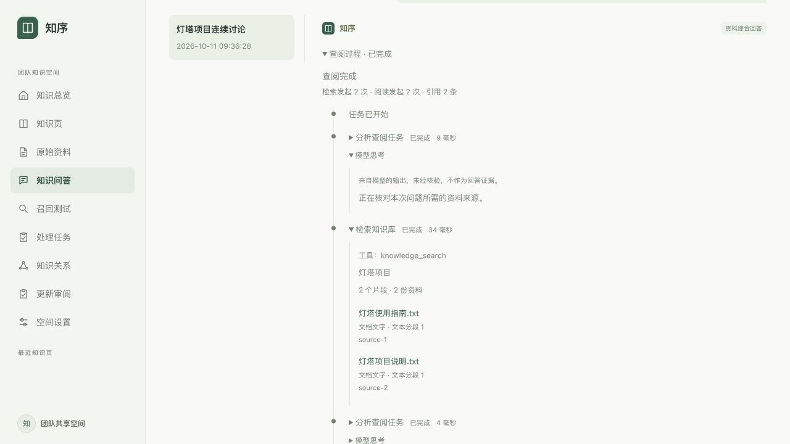

# 本机页面验收

2026-10-11；前端HEAD5c5fd79b376c45395918a3e20bd8d8ac2f60bf2b及当前未提交工作树，配套后端0071。

- 最终完整串行513/513、相关74/74、JS语法与diff检查通过。7条新增核心回归覆盖可选details、安全文本、重复工具选择、状态原位更新、展开/焦点保存、reasoning缺省/转义及TXT/PDF定位。中途旧事件精确形状断言失败通过保留缺省details原shape修复，没有放宽旧断言。
- 后端Java74/74、Python117/117与全新快照WikiWorkflowHttpTest1/1通过，详见后端0071/verification.md。
- 本机前端18241→Java18242→Python18243，独立新数据和合成模型。两份TXT自动索引后，两轮原生问答都有真实执行metadata和fixture明确返回的reasoning；同库Spring重启后全部对话/events/原件SHA只读回读保持。
- 实际浏览器打开持久会话`a70107be-2a6a-450f-91a5-2c74afd29270`，展开“查阅过程”→“模型思考”和检索事件，看到准确返回文本、query、2个片段/2份资料、耗时及source编号。刷新后重新展开仍一致；TXT定位显示“文本分段1”，不冒称物理页。
- 当前保留默认桌面视口；本轮未做真实手机/窄屏视觉验收。轮询期间展开与键盘焦点保留由组件回归覆盖，未用截图代替该断言。

截图为本机合成协议验收，不是真实DeepSeek输出：

当前为逐轮响应完成后轮询显示，不是token流式输出。不改生产/旧18090实例，不提交或推送，真实模型请求0。无reasoning字段的模型不显示该区域；旧记录不补造。
